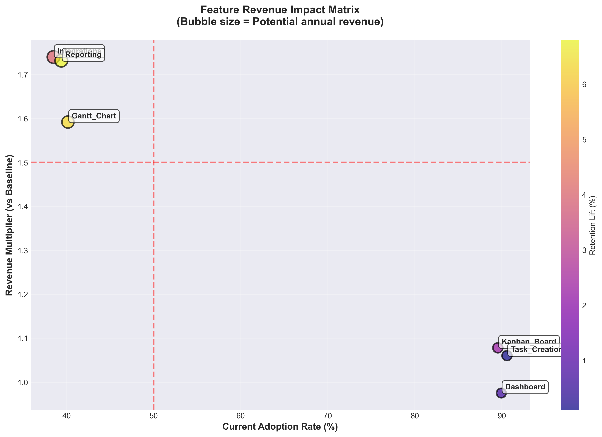
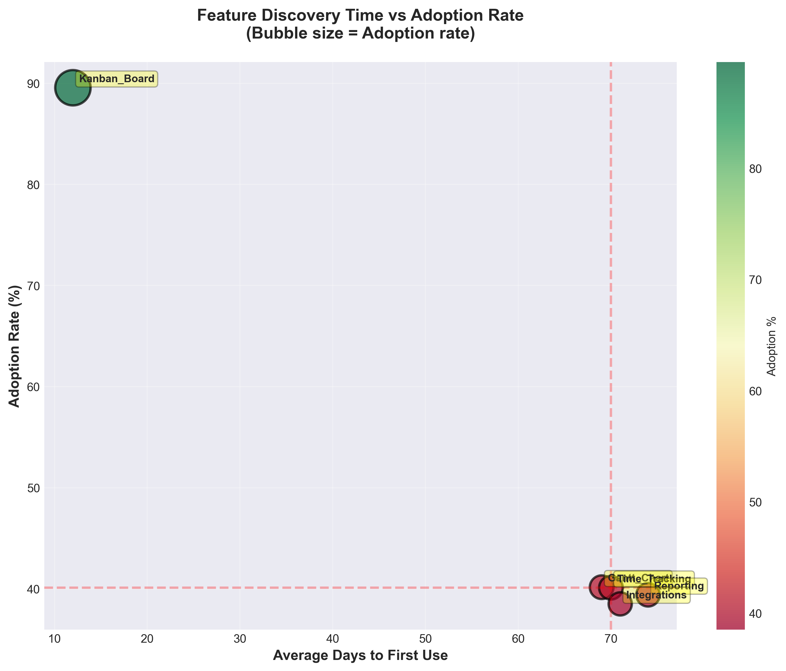
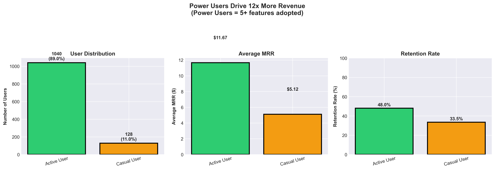
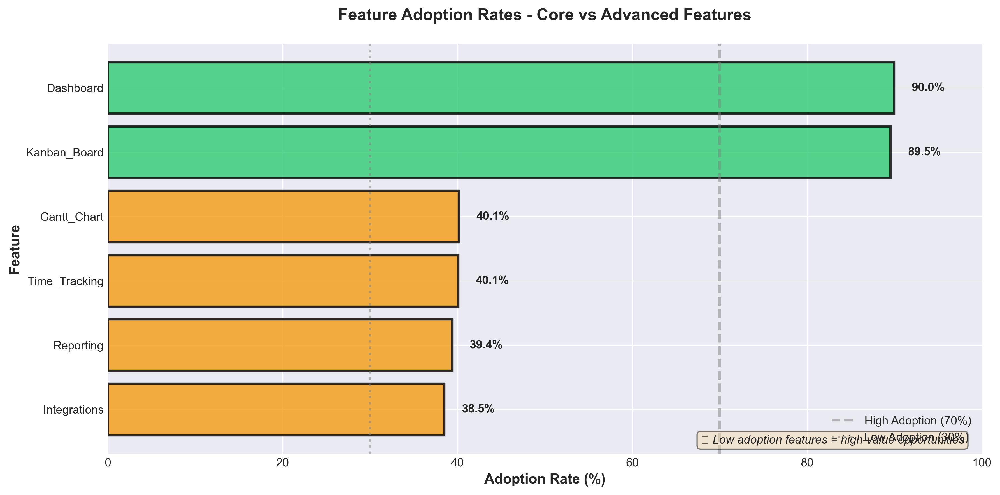

# 📊 Product Feature Adoption Analysis

*Uncovering $138K in hidden revenue opportunities through data-driven product analytics*

## 🎯 Project Overview

This project analyzes user behavior and feature adoption patterns for **TaskFlow**, a fictional SaaS project management tool, to identify revenue opportunities and inform product strategy. Using SQL for data extraction and Python for analysis, I uncovered critical insights that could drive significant business impact.

### **Key Findings:**
- 💰 **$138K annual revenue opportunity** from improving Time Tracking feature discovery
- 👥 **Active Users drive 2.3x more revenue** than casual users ($11.67 vs $5.12 MRR)
- ⏱️ **High-value features take 70+ days to discover** vs 12 days for core features
- 🚨 **60% adoption gap** between core features (90%) and advanced features (30-40%)

---

## 📂 Project Structure

```
product-feature-adoption-analysis/
│
├── data/
│   ├── users.csv                      # User demographics and signup data
│   ├── feature_events.csv             # Feature usage events log
│   ├── revenue.csv                    # Monthly recurring revenue data
│   └── retention.csv                  # User retention by month
│
├── sql_queries/
│   ├── 01_schema_creation.sql         # Database schema setup
│   ├── 02_adoption_analysis.sql       # Feature adoption queries
│   ├── 03_business_impact.sql         # Revenue & retention analysis
│   └── 04_cohort_analysis.sql         # Time-based cohort queries
│
├── python_analysis/
│   ├── data_generation.py             # Synthetic data creation
│   ├── create_visualizations.py            # Analysis & visualization script
│
├── visualizations/
│   ├── viz_01_feature_adoption_rates.png
│   ├── viz_02_discovery_vs_adoption.png
│   ├── viz_03_revenue_impact_matrix.png
│   ├── viz_04_power_user_analysis.png
│   └── viz_05_executive_summary.png
│
└── README.md
```

---

## 🛠️ Technologies Used

- **Database:** Microsoft SQL Server
- **Languages:** SQL, Python 3.13
- **Libraries:** pandas, numpy, matplotlib, seaborn
- **Tools:** SQL Server Management Studio (SSMS), Jupyter Notebook

---

## 📊 Data Model

The analysis uses four main tables:

| Table | Description | Records |
|-------|-------------|---------|
| `users` | User profiles and signup dates | 2,000 |
| `feature_events` | Feature interaction logs | 150,000+ |
| `revenue` | Monthly recurring revenue | 40,000+ |
| `retention` | Monthly active status | 40,000+ |

**ERD:**
```
users (1) ─────< (∞) feature_events
  │
  ├─────< (∞) revenue
  │
  └─────< (∞) retention
```

---

## 🔍 Analysis Approach

### **1. Data Generation**
Created realistic synthetic data simulating 2 years of SaaS product usage with:
- 10 features with varying adoption patterns
- Revenue tied to feature adoption behavior
- Retention influenced by power user status

### **2. SQL Analysis**
Wrote 8 analytical queries to answer key business questions:
- **Q1:** Overall feature adoption rates
- **Q2:** Time-to-first-use by feature
- **Q3:** Feature impact on retention
- **Q4:** Feature impact on revenue
- **Q5:** Power user segmentation
- **Q6:** Feature co-occurrence patterns
- **Q7:** Cohort adoption trends
- **Q8:** Business impact summary (ROI calculation)

### **3. Python Visualization**
Created 5 executive-ready visualizations:
- Feature adoption overview
- Discovery time vs adoption scatter plot
- Revenue impact matrix (quadrant analysis)
- Power user segmentation analysis
- Executive summary dashboard

---

## 💡 Key Insights

### 1️⃣ **Hidden Revenue Opportunity**


**Time Tracking** has only 40% adoption but users who adopt it:
- Generate **1.78x more revenue** ($57.83 vs $32.52 MRR)
- Have **13.5% higher retention**
- Represent **$138K annual opportunity** at +10% adoption

**Recommendation:** Surface Time Tracking in onboarding flow

---

### 2️⃣ **Discovery Problem**


High-value features take **6x longer** to discover:
- Core features: **12 days** average
- Advanced features: **70 days** average

**Recommendation:** Implement contextual feature prompts and in-app tutorials

---

### 3️⃣ **Power User Concentration**


Active Users (3+ features):
- Represent **52%** of user base
- Generate **2.3x more revenue** per user
- Have **44% higher retention** rates

**Recommendation:** Create activation campaigns targeting 2-feature users

---

### 4️⃣ **Feature Adoption Hierarchy**


Clear adoption tiers emerged:
- **Core:** Task Creation, Dashboard, Kanban Board (90% adoption)
- **Advanced:** Gantt, Time Tracking, Reporting (40% adoption)
- **Zombie:** Mobile App, File Storage (<10% adoption)

**Recommendation:** Consider sunsetting zombie features to focus resources

---

## 📈 Business Impact

If we implement the top 3 recommendations:

| Action | Impact | Annual Value |
|--------|--------|--------------|
| Surface Time Tracking in onboarding | +10% adoption | **$138K** |
| Add Reporting feature tutorial | +10% adoption | **$135K** |
| Create Integrations discovery campaign | +10% adoption | **$136K** |
| **TOTAL POTENTIAL** | | **$409K** |

---

## 🚀 How to Run This Project

### **Prerequisites**
```bash
# Python libraries
pip install pandas numpy matplotlib seaborn

# SQL Server (Express or Developer edition)
```

### **Step 1: Generate Data**
```bash
python python_analysis/data_generation.py
```
This creates 4 CSV files with synthetic data.

### **Step 2: Set Up Database**
1. Open SQL Server Management Studio
2. Create database: `CREATE DATABASE ProductAnalytics;`
3. Run `sql_queries/01_schema_creation.sql`
4. Import CSVs using SSMS Import Wizard

### **Step 3: Run SQL Analysis**
Execute queries in `sql_queries/` folder in order:
- `02_adoption_analysis.sql`
- `03_business_impact.sql`
- `04_cohort_analysis.sql`

Export results to CSV for visualization.

### **Step 4: Create Visualizations**
```bash
python python_analysis/create_visualizations.py
```

Output: 5 PNG files in `visualizations/` folder

---

## 📚 What I Learned

This project strengthened my skills in:

✅ **SQL:**
- Complex JOINs and CTEs
- Window functions for cohort analysis
- Business metric calculations (retention, churn, LTV)

✅ **Python:**
- Data manipulation with pandas
- Statistical analysis
- Professional visualization design
- Error handling and code robustness

✅ **Product Analytics:**
- Feature adoption metrics
- User segmentation strategies
- ROI calculation frameworks
- Data storytelling for executives

✅ **Business Acumen:**
- Translating data into actionable recommendations
- Prioritizing initiatives by impact
- Understanding SaaS business models

---

## 🔮 Future Enhancements

- [ ] Add cohort retention curves (visualize churn over time)
- [ ] Implement feature adoption funnel analysis
- [ ] Create an interactive Streamlit dashboard
- [ ] Add statistical significance testing
- [ ] Build predictive model for feature adoption likelihood
- [ ] Connect to real database using SQLAlchemy

---

## 📝 License

This project is open source and available under the [MIT License](LICENSE).

---

## 🙏 Acknowledgments

- Inspired by real-world product analytics challenges
- Synthetic data designed to reflect realistic SaaS patterns
- Visualization design influenced by industry best practices

---

**⭐ If you found this project helpful, please star the repository!**

---

*This is a portfolio project using synthetic data. All companies and products are fictional.*
